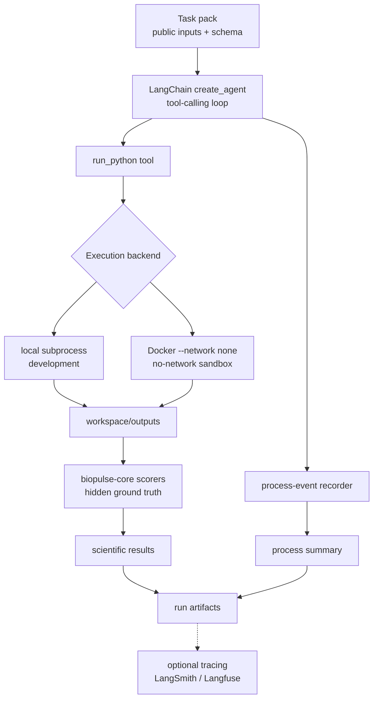

# BioPulse

[](https://github.com/yyw-informatics/BioPulse/actions/workflows/ci.yml)    

BioPulse is a LangChain/LangGraph harness for evaluating AI agents on data-analysis
tasks. It wraps the separate, framework-agnostic
[BioPulse_core](https://github.com/yyw-informatics/BioPulse_core) package, which owns the
benchmark registry, dataset builders, deterministic scorers, and process-plane reducer.

This repository focuses on the agent-facing harness:

- a LangChain 1.x `create_agent` tool-calling loop
- a `run_python` tool that executes agent-written analysis code in a task workspace
- dual-plane scoring artifacts for scientific output quality and agent behavior
- optional tracing to Langfuse or LangSmith
- an optional Docker no-network execution backend for contamination-resistant runs

## System Flow



## Evaluation Planes

BioPulse evaluates agents on two complementary planes:

- **Scientific Artifact plane:** deterministic task metrics against hidden ground truth, such as
  schema validity, report presence, and task-specific accuracy/F1/MSE.
- **Agent Process plane:** behavioral signals from the run, such as model turns, code executions,
  crashes, timeouts, code-error rate, network attempts, and blocked contamination attempts.

The hidden ground truth is never copied into the agent workspace. The agent sees only public task
inputs, task instructions, and the required output schema.

## What This Demonstrates

This project is meant to show AI evaluation system design, not just an agent demo:

- **Modern LangChain/LangGraph usage:** `langchain.agents.create_agent` compiles the tool-calling
  loop, while middleware handles process-event recording, output-based stopping, and loop caps.
- **Evaluation separation:** the harness does not reimplement benchmark metrics; it delegates
  scoring and workspace setup to `biopulse-core`.
- **Reproducible run artifacts:** each run writes a manifest, scientific evaluator results,
  process summary, cost/token artifacts, and optional placement/behavior summaries.
- **Contamination controls:** local development can use a Python socket-layer guard for audit
  signals; enforced no-network execution is provided by the `docker-none` backend.

## Core Boundary

The evaluation core is imported from `biopulse` and reused as a library:

```python
from biopulse.tasks.registry import get, required_outputs
from biopulse.runner.process_plane import summarize_process
from biopulse.runner.evidence import copy_public_to_workspace

record = get("label_projection")
required = required_outputs(record.task_type)
scientific = record.scorer(benchmark_dir, run_dir, run_id=run_id)
```

This repository contributes the agent loop, execution backend, tracing integration, and run
orchestration around [BioPulse_core](https://github.com/yyw-informatics/BioPulse_core).

## Implementation Notes

- The main agent loop uses `langchain.agents.create_agent`, which compiles to a LangGraph runtime.
  This avoids the deprecated `langgraph.prebuilt.create_react_agent` path.
- Output-based stopping is implemented as LangChain middleware: `FinishOnOutputs.after_model`
  checks for required files and returns `{"jump_to": "end"}` with `@hook_config(can_jump_to=["end"])`.
- The loop budget is tracked as model turns in the process-event middleware. It is not delegated to
  LangGraph's `recursion_limit`, which is a runtime safety guard and raises on overflow.
- Anthropic prompt caching is applied only for Anthropic models through LangChain middleware.
  Token accounting stores total input tokens plus cache-read/cache-write counts separately so the
  downstream cost calculator can price cached and uncached tokens correctly.
- The OpenAI Agents SDK path shares the same workspace, `run_python` tool implementation, scoring
  path, cost contract, and execution backends; only the agent loop differs.

## Install

```bash
conda create -n biopulse-lg python=3.12 -y
conda activate biopulse-lg

# Local evaluation core dependency.
export BIOPULSE_CORE=../biopulse-core
pip install -e "$BIOPULSE_CORE"

# This harness and its LangChain/LangGraph stack.
pip install -e .
```

For the default Claude model, create a local `.env` file and set `ANTHROPIC_API_KEY`:

```bash
ANTHROPIC_API_KEY=
BIOPULSE_TRACER=none
```

Tracing is optional. Set `BIOPULSE_TRACER=langfuse` with Langfuse credentials, or
`BIOPULSE_TRACER=langsmith` with `LANGSMITH_API_KEY`. With no tracing credentials, runs still
execute and write local artifacts.

## Run Locally

The default execution backend is `local`, which runs `run_python` as a host subprocess. This mode is
useful for development and fast iteration.

```bash
python -m biopulse_lg.run \
  --task label_projection \
  --benchmark "$BIOPULSE_CORE/benchmark_packs/op_label_projection_mini" \
  --model claude-sonnet-4-6
```

## Enforced No-Network Runs

For contamination-resistant L1-style runs, build the runner image and select the Docker backend:

```bash
docker build -f docker/runner.Dockerfile -t biopulse-runner:py312 .

python -m biopulse_lg.run \
  --task label_projection \
  --benchmark "$BIOPULSE_CORE/benchmark_packs/op_label_projection_mini" \
  --model claude-sonnet-4-6 \
  --execution-backend docker-none
```

`docker-none` runs each `run_python` script with Docker `--network none`, a read-only container
filesystem, a read-only workspace mount, and only `workspace/outputs/` mounted writable. This is the
mode to cite for enforced no-network execution.

For L2-L4 style runs that allow some web access while blocking answer-source hosts, the current
implementation provides Python socket-layer blocking and audit logging. Stronger controlled-web
egress would require a proxy or firewall-backed container network.

## Benchmark Packs

Benchmark packs are built by `biopulse-core`. The core ships the builder; the Open Problems source
data is expected to live outside this repository.

```bash
export BIOPULSE_CORE=../biopulse-core
export OPENPROBLEMS_ROOT=../openproblems

PYTHONPATH="$BIOPULSE_CORE" \
python "$BIOPULSE_CORE/scripts/build_benchmark_packs.py" \
  --openproblems-root "$OPENPROBLEMS_ROOT" \
  --out "$BIOPULSE_CORE/benchmark_packs" \
  --tasks label_projection
```

## Run Artifacts

Each run writes artifacts under `runs/<run_id>/`:

- `run_manifest.json`: task, model, backend, timing, produced files, and hidden-ground-truth check
- `evaluator_results.json`: scientific-plane scores and violations
- `process_summary.json`: process-plane behavioral summary
- `cost_summary.json` and `token_usage.json`: model usage and estimated cost
- `behavior_summary.json`: extended harness-specific behavior metrics when available
- `placement.json`: optional leaderboard placement when a benchmark pack provides one

Generated run directories are ignored by git.

## Tests

```bash
conda run -n biopulse-lg python -m pytest -q
```

The offline suite covers the LangChain agent loop with a scripted fake model, process-event
recording, scoring integration, tracing selection, behavior summaries, harness levels, and the
Docker no-network command construction.
